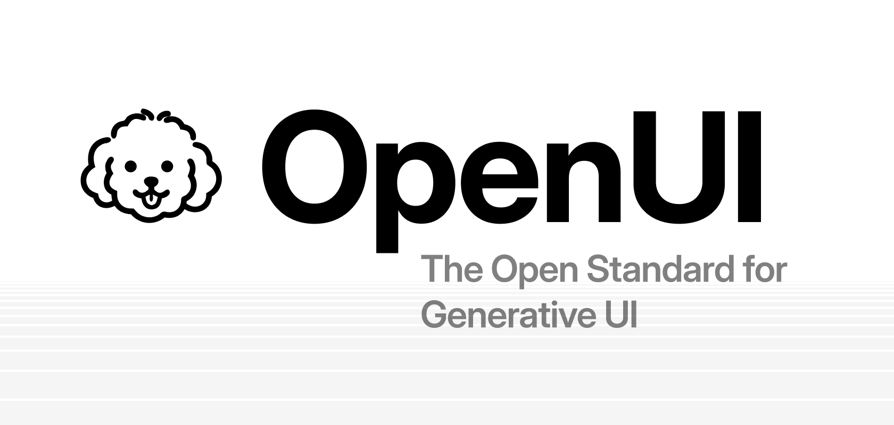
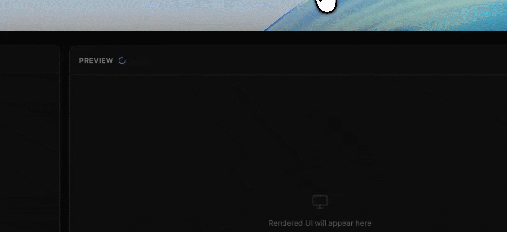

# OpenUI - The Open Standard for Generative UI

  
  
  

OpenUI is a full-stack Generative UI framework: a compact streaming-first language, a React runtime with built-in component libraries, and ready-to-use chat interfaces that are up to 67% more token-efficient than JSON.

[Docs](https://openui.com) · [Playground](https://www.openui.com/playground) · [Discord](https://discord.com/invite/Pbv5PsqUSv) · [Contributing](./CONTRIBUTING.md)

> **Important:** OpenUI has no official cryptocurrency, token, or coin. Any asset using the OpenUI name is unaffiliated with this project and is not endorsed by its maintainers.

---

## What is OpenUI

At the center of OpenUI is **OpenUI Lang**: a compact, streaming-first language for model-generated UI. Instead of treating model output as only text, OpenUI lets you define components, generate prompt instructions from that component library, and render structured UI as the model streams.

**Core capabilities:**

- **OpenUI Lang** - A compact language for structured UI generation designed for streaming output.
- **Built-in component libraries** - Charts, forms, tables, layouts, and more, ready to use or extend.
- **Prompt generation from your component library** - Generate model instructions directly from the components you allow.
- **Streaming renderer** - Parse and render model output progressively in React as tokens arrive.
- **Chat and app surfaces** - Use the same foundation for assistants, copilots, and broader interactive product flows.

## Packages

The following packages are available:

| Package | Description | Documentation |
| --- | --- | --- |
| `@openuidev/browser-bundle` | Browser bundle for CDN, iframe, and no-build integration | [README](https://github.com/thesysdev/openui/tree/main/packages/browser-bundle) |
| `@openuidev/cli` | Command-line interface for creating and managing OpenUI projects | [README](https://github.com/thesysdev/openui/tree/main/packages/cli) |
| `@openuidev/lang-core` | Framework-agnostic core for OpenUI Lang | [README](https://github.com/thesysdev/openui/tree/main/packages/lang-core) |
| `@openuidev/react-email` | React components for email integration | [README](https://github.com/thesysdev/openui/tree/main/packages/react-email) |
| `@openuidev/react-headless` | React headless components for server-side rendering | [README](https://github.com/thesysdev/openui/tree/main/packages/react-headless) |
| `@openuidev/react-lang` | React runtime for OpenUI Lang | [README](https://github.com/thesysdev/openui/tree/main/packages/react-lang) |
| `@openuidev/react-ui` | React UI components for OpenUI | [README](https://github.com/thesysdev/openui/tree/main/packages/react-ui) |
| `@openuidev/svelte-lang` | Svelte runtime for OpenUI Lang | [README](https://github.com/thesysdev/openui/tree/main/packages/svelte-lang) |
| `@openuidev/vue-lang` | Vue runtime for OpenUI Lang | [README](https://github.com/thesysdev/openui/tree/main/packages/vue-lang) |

## Quick Start
