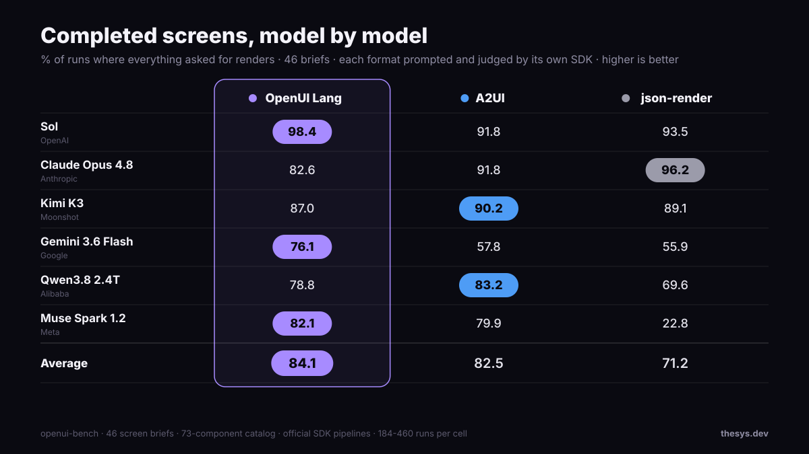
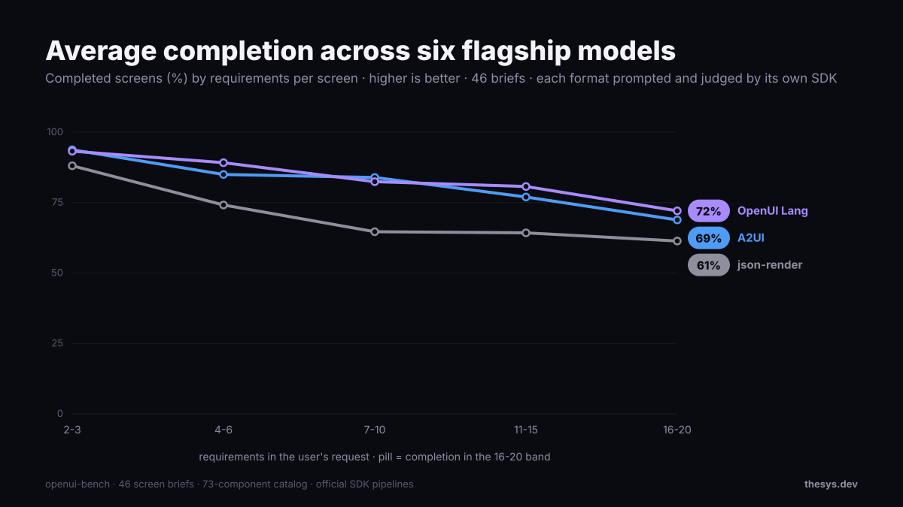
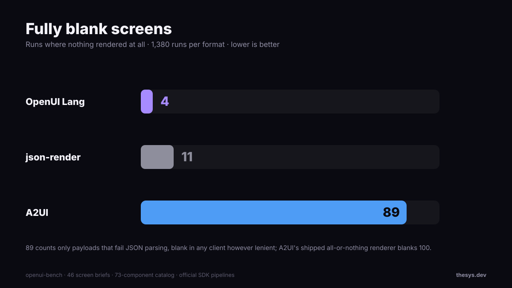
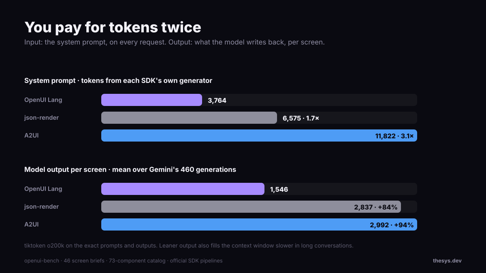
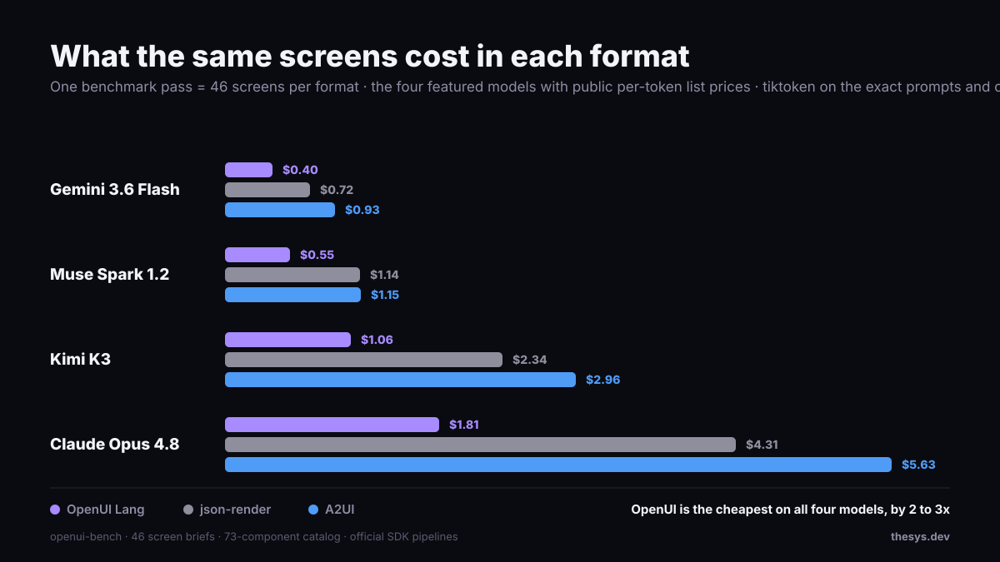
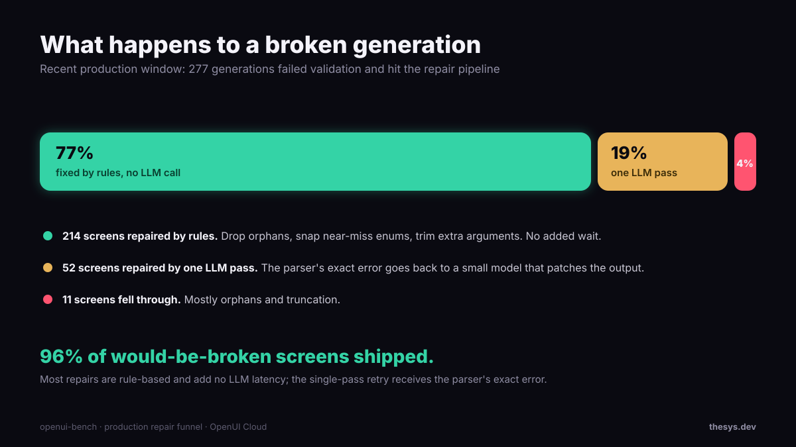

We ran the same 46 prompts through the 3 different Generative UI formats, OpenUI, Google A2UI and Vercel json-render on 6 different models across different model families.
<br /> OpenUI rendered the most screens on an average (84.1%) compared to A2UI (82.5%) and json-render (71.2%) while consuming half the tokens.
<br /> A2UI performed the worst when it came to blank screens, with 89 out of 828 runs resulting in a fully blank screen while OpenUI only failed to render 4 times vs json-render's 11.




## Methodology
We chose 6 frontier models from various model families to test the 3 different Generative UI formats, OpenUI, Google A2UI and Vercel json-render.
For all of these combinations we used the same component catalog of 73 components that we use in production in OpenUI Cloud with a few minor modifications.
For each format we used the official prompt and parser from the SDK's documentation.
In total 46 different prompts were used that mirror real life requests. None of them name a component or a layout to mimic real life user queries.

For evaluation we used the following metrics:
- Completeness: Every prompt is rendered, every reference is resolved without silently dropping anything. Higher is better
- Empty responses: Whether the user saw anything at all. If the response completely failed to render then we count that separately from completeness.
  Naturally the lower the score in this rubric, the better.

## Results

### No format wins on every model

- GPT-5.6 Sol is nearly flawless with OpenUI at 98.4%.
- Claude Opus 4.8 was the result we didn't expect: 96.2% with json-render, the best json-render number from any model, with OpenUI last on the same screens.
- Kimi K3 is a coin flip: 90.2 (A2UI), 89.1 (json-render), and 87.0 (OpenUI) are all within error margins at this sample size.
- Gemini 3.6 Flash, a small lightweight model, splits hardest: 76.1% with OpenUI against 57.8 (A2UI) and 55.9 (json-render).

We suspect heavy JSON post-training explains part of the spread, making JSON scaffolding strong on some models while a compact line-based DSL wins on the rest, but we haven't tested that hypothesis.
If you use a fixed model, benchmark that model. If you support several, the average matters more.

### Screens get harder as they grow



Every format degrades as generations become complicated to involve more components (which is expected).
<br /> json-render scores fall steeply, from 88% on 2-3 requirement screens to 61% on 16-20.
<br /> OpenUI & A2UI closely tail each other with OpenUI slightly outperforming A2UI at most points.

The odd one out is Meta's Muse Spark: it essentially can't write json-render (22.8% completeness; it loses track of the props-versus-children split and drops required fields 122 times across its runs) yet completes 82.1% in OpenUI, the widest gap across the same model-format choice.

Note: When we added a rule telling the model to "attach every component it defines" it added 13 points to OpenUI on Kimi meaning that each model+format combination needs prompt tuning to ensure we get the most out of it.

### When it fails, what does the user see?



The completion rubric treats a missing component and a fully blank screen the same but in real life your users wouldn't.
We added a rescoring script to analyze how many of the generations actually resulted in a fully blank screen from the user's perspective.

OpenUI failed to render only 4 times out of 828 runs and all four were one model (Muse) returning an empty response.
A2UI's default renderer, which drops the whole updateComponents message if it has any invalid component structure, blanked out 100 times. Counting conservatively - only payloads that were completely broken because the JSON itself fails to parse - we still get 89 completely blank screens.
json-render failed 11 times.

The main difference in how these formats are interpreted: each OpenUI component is one line, so a parse error costs that line, while a JSON document has no smaller unit to fall back to.
This does lead to OpenUI trading blank screens for partial ones which can be harder to notice which is why we track the completion rubric separately.
Rescoring scripts for both these rubrics are in the repo.

## Tokens



Given input tokens & tool definitions are developer defined in all three formats, the token overhead comes from 2 categories:
- **System Prompt** that goes in every request: 3,764 tokens for OpenUI, 6,575 for json-render, 11,822 for A2UI for the same component library generated by the respective SDKs.
- **Output Tokens** become a factor of format verbosity. The same header is one line in OpenUI, a patch operation in json-render, a wrapped message in A2UI.

The same header, in each format's wire shape
```shell
# openui-lang: one line
header = Header("Executive Revenue Dashboard", "Q4 Performance Overview")

# json-render: one patch of many
{"op":"add","path":"/elements/header_main","value":{"type":"Header","props":{...}}}

# A2UI: one wrapped message
{"version":"v0.9","updateComponents":{"surfaceId":"main","components":[{...}]}}
```
Token optimizations are not just about output token size but a leaner format streams much faster and reduces the context size on follow up turns leading to a better UX and more turns per 100k context window.

## Cost
Generating the identical 46 screens costs up to 3x less in OpenUI on the four models with public list prices.
One pass costs \$1.81 in OpenUI on Claude Opus 4.8. The same screens in A2UI cost \$5.63.



## Lessons from running Generative UI in production

We have been running OpenUI and its predecessor (Thesys C1) in production for a year now. Here is some of our learnings from the field:

We tried few-shot examples, schema reordering, and different prompt styles. They changed which errors we saw, but not the overall failure rate.
Giving the model more reasoning time helped, but added too much latency for real-time UI.
That pushed us toward repairing the output instead of continuing to tune the prompt.

Overall error rates were 15% on the older json-based format which have now dropped to 4-5% after migrating to OpenUI.
Here is the error reason distribution sampled from our production dataset:

MERGE THIS TABLE WITH THE GRAPH BELOW

| Failure family | Share |
| --- | --- |
| No valid root | 29.6% |
| Reference graph | 27.5% |
| Enum and type mismatches | 22.9% |
| Truncation | 13.6% |
| Wrong argument counts | 4.9% |
| Everything else | 1.5% |



Most of these are mechanical. Orphans can be garbage-collected, near-miss enums snapped to valid values, typo'd references matched to the nearest defined name.
None of that needs an LLM for error correction, and because every OpenUI component is one named line, a repair touches only the broken lines by reusing
the same property that powers [incremental editing](/docs/openui-lang/incremental-editing)


### The number we actually run on

Failures happen 4 to 5% of the time.
The repair pipeline catches 96% of those.
Multiply the two and roughly 2 screens in 1,000 (0.2%) reach an OpenUI Cloud user broken and we are actively working towards reducing that number down to 0.

Our takeaway is that raw completion rate isn't the whole story; how a format fails matters as much.
OpenUI's line-level structure kept failures small enough to contain and repair, which is why we ended up building the production system around repair instead of trying to eliminate generation errors entirely.
Whatever format you pick, at enough volume you'll want that repair layer too.

---

Footnotes:
- We built OpenUI Lang, so read this as a first-party benchmark with everything disclosed.
- An extended Terra run, also OpenAI, put OpenUI first at 81.0 vs 77.2 and 73.4, but stays out of the average to keep one seat per company.
- The numbers are mean of six per-model completion rates where each model gets equal weight (not number of runs). Gemini ran first at 10 generations per brief; later models ran 4 to cap cost. The per-model mean keeps raw counts from skewing the average.
- Each model runs its measured-best official prompt condition: OpenUI has two official prompt sources plus one optional rule, json-render ran with and without one extra rule, A2UI ran its generator's prompt as-is.
- Scoring is each SDK's own shipped code plus one shared completeness layer with a coverage floor; for json-render that layer is stricter than its own validator.
- The full judgment-call list, all code, prompts, and every raw output: [benchmark repo](https://github.com/thesysdev/openui/tree/main/benchmarks/openui-bench).
- The method builds on Mobile Reality's [MDMA benchmark](https://github.com/MobileReality/mdma/tree/main/benchmarks/genui-formats).
