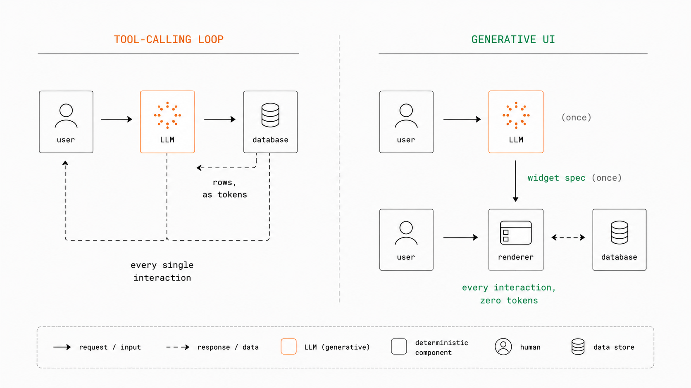
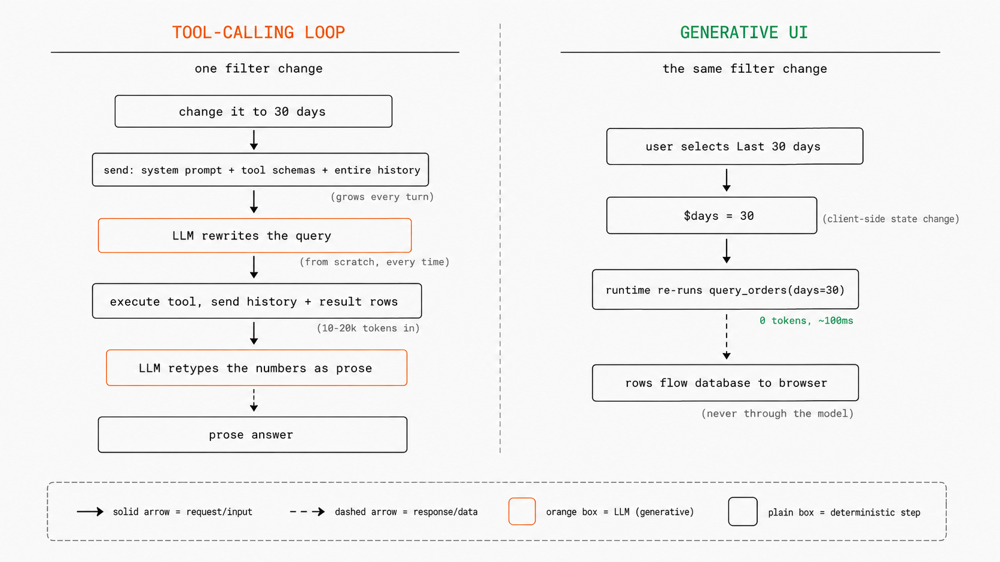
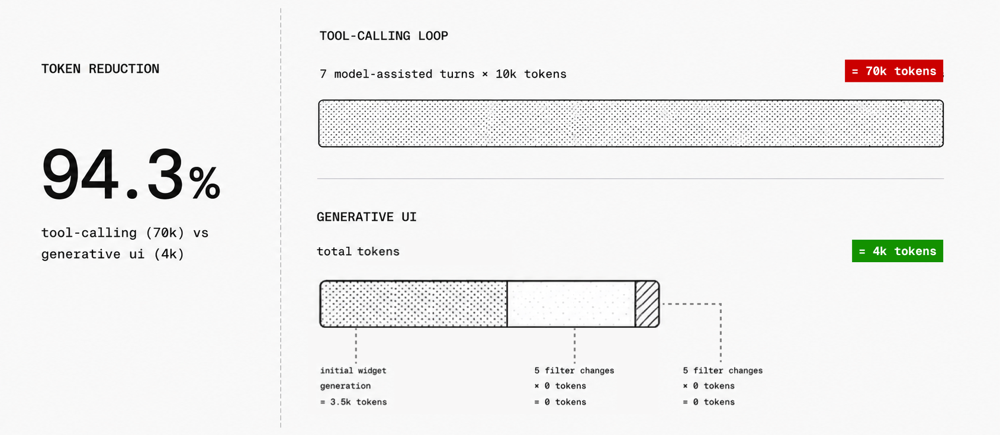

import { LiveFilterDemo } from "./components/live-filter-demo";

Conversational data applications give the model two jobs that are usually conflated: **understanding what the user wants** and **fetching the data**. The first is what language models are good at. The second is a systems problem that language models solve badly, at a cost that grows with every interaction.

This post examines the dominant architecture for these applications (the tool-calling loop), analyzes where its costs come from, and presents the Generative UI alternative: the model generates an interactive interface once, and all later data access happens outside the model. The demo below shows both side by side.

<LiveFilterDemo />

## Status quo: the tool-calling loop

The standard architecture for an AI data application is a function-calling loop. The application exposes a set of tools (SQL queries, API endpoints, aggregation functions), and the model calls them in conversation. Every interaction, including trivial ones, flows through the model:



Consider the left panel of the demo above. A user is viewing revenue for the last 7 days and wants 30 instead. Here is that adjustment through both architectures:



The model is called twice per turn: once to write the tool call, once to interpret its result. Both calls carry the full conversation history, and the result rows enter the context window, where they stay for the rest of the session.

This architecture is the default for good reasons: it needs no client-side runtime, it handles arbitrary requests, and it maps directly onto the function-calling APIs every model provider ships. For one-off questions it is the right design. The problems appear when the workload is interactive, when the same user keeps adjusting the same data.

## Problem analysis

Three costs compound in the tool loop, and all three scale with how often the user interacts, not with how hard the request is.

**1. History accumulation.** Each turn re-sends the full conversation, which in a data application contains every previous tool result. The tenth filter adjustment costs more than the first, despite being the same operation.

**2. Data ingestion.** For data-heavy workloads this is the dominant term: a 500-row aggregate serializes to 10 to 20k tokens, and it stays in the context for every later turn. The model is being used as a channel for moving data, the most expensive one available.

**3. Query re-derivation.** The query is rewritten from scratch on every turn, and each rewrite is a fresh sample from the model. A region filter set in turn 3 can be silently dropped in turn 7; nothing guarantees consistency between one turn's query and the next.

There is a fourth cost that is harder to measure: **every number the user reads was retyped by the model.** It receives rows and types them back as prose. A transposed digit or a mixed-up row is a silent failure; no part of the system can check a narrated figure against the underlying data.

Latency has the same shape. Each adjustment pays two model calls with a growing prompt, so the smallest interactive change (a dropdown) pays the full round-trip price. And the answer is static prose: every adjustment to it forces another model call.

## The Generative UI alternative: the model generates the interface

Generative UI changes the model's role. Instead of answering with data, the model writes a short declarative spec for an interactive widget: controls, visualizations, and the queries that feed them. Data access moves out of the model entirely and into a client-side runtime.

In [OpenUI Lang](/docs/openui-lang/overview), the response to "show revenue by region, filterable by date range" is:

```text
$days = "7"
root = Stack([filter, chart, tbl])
filter = Select("days", [SelectItem("7", "Last 7 days"), SelectItem("30", "Last 30 days"), SelectItem("90", "Last 90 days")], null, null, $days)
metrics = Query("query_orders", {days: $days, groupBy: "region"}, {rows: []})
chart = BarChart(metrics.rows.region, [Series("Revenue", metrics.rows.revenue)])
tbl = Table([Col("Region", metrics.rows.region), Col("Revenue", metrics.rows.revenue, "number")])
```

Six statements, a few hundred output tokens, and no data anywhere in them. `metrics.rows.revenue` is a reference the runtime resolves, not a value the model typed. Three pieces make it work:

**Reactive state.** `$days` is a [state variable](/docs/openui-lang/reactive-state), bound two-way to the `Select`. State lives in the client runtime, not in the conversation.

**Declared queries.** [`Query`](/docs/openui-lang/queries-mutations) names a tool, its parameters, and which state variables feed it. Whenever a referenced `$variable` changes, the query re-runs. The query itself is fixed at generation time; only its parameters change afterward.

**A runtime executor.** The renderer runs queries directly against the application's tool layer (an API route, an MCP endpoint, a database function). The model is not on this path.

This is what the right panel of the demo does, and the right half of the diagram above: the state variable updates, the runtime re-runs the declared query in about 100ms at zero tokens, and the rows flow from the database straight to the browser. The model is never contacted: a filter change is deterministic re-execution of a declared query with new parameters. The model handles intent; the runtime handles interaction.

### Regeneration is also restructured

Interactions that change intent rather than parameters ("break this down by category instead") do return to the model, but the round trip is smaller on both sides.

The input is data-free: the follow-up ships with the current widget spec, the six statements above, not the result sets behind them. Tool-loop history accumulates data; Generative UI history accumulates specs, a compact and roughly constant-size record of application state.

The output is a delta. The spec language is assignment-based and the last definition of a name wins, so the model redeclares only the statements that changed:

```text
metrics = Query("query_orders", {days: $days, groupBy: "category"}, {rows: []})
chart = BarChart(metrics.rows.category, [Series("Revenue", metrics.rows.revenue)])
tbl = Table([Col("Category", metrics.rows.category), Col("Revenue", metrics.rows.revenue, "number")])
```

The runtime merges these into the running program ([incremental editing](/docs/openui-lang/incremental-editing)). `$days`, `filter`, and `root` are untouched and keep working, and the new query runs outside the model, same as a filter change.

## Trade-off comparison

Both kinds of change compare favorably to the loop:

| Change type                            | Tool-calling loop                             | Generative UI                                                     |
| -------------------------------------- | --------------------------------------------- | ----------------------------------------------------------------- |
| Parameter change (filter, date range)  | Full round trip + result rows through context | **Zero tokens.** Runtime re-executes the declared query           |
| Intent change (new breakdown, new viz) | Full round trip + result rows through context | **Reduced LLM call.** Spec in, delta out; data bypasses the model |

### **Generative UI can reduce LLM token usage by about 94%**

Consider a representative session with one initial question, five filter changes, and one intent change:

1. "Show revenue for the last 7 days by region."
2. Change the range to 30 days.
3. Select Europe.
4. Select electronics.
5. Return to 7 days.
6. Select all regions.
7. "Now group it by category."

For a conservative estimate, assume each tool-loop turn costs 8k tokens for the query result and 2k for the prompt, tool call, and answer. We deliberately leave out re-sending earlier results, even though they stay in the history.



The estimate favors the loop on purpose: in a real conversation, later turns also re-send earlier result sets, which makes them more expensive and the savings larger. Prompt caching narrows the history cost but not the rest. Rows still enter the context on every turn, and the model still rewrites the query on every turn.

**Latency.** A parameter change drops from a two-call model round trip (seconds) to a single database query (~100ms). Intent changes are faster too: the model streams a three-statement delta while the existing interface stays rendered, and because the `root` statement streams early, the interface shell renders before generation completes.

**Reliability.** The two architectures differ in what kind of error they make.

Tool-loop failures live in the data: made-up or miscopied values in narration, inconsistent query rewrites across turns. Both are silent; nothing exists to check a narrated number against.

In Generative UI, **every displayed number comes from a real query result**: the model writes references that the runtime resolves, so an invented value would have to appear as a literal in the spec, where it is easy to catch. What can still go wrong is small and visible: a filter bound to the wrong parameter, a misleading chart title. The parser catches the structural cases before render and sends them back for correction, and the rest show up on screen, where a chart grouped by the wrong dimension gets fixed in one message. A wrong number in prose is never noticed.

## Edge cases and limitations

Generative UI changes where the model sits. It does not remove the model, and it does not fit every workload.

**The widget only handles interactions it was built with.** If the dashboard has date and region filters, changing either is free. If the user asks to compare currencies and no currency control exists, the request returns to the model, which can add the control; after that, currency changes are free too.

**Some questions need new computation.** A predefined tool like `query_orders` covers common filters, but not "correlate refund rates with shipping carriers." For those, the model can generate a SQL or Python script, bind its output to the widget, and run it outside the LLM, which still keeps the result sets out of the context window. Generated code must run in a sandbox with restricted data access, time limits, and resource limits.

**The generated interface can still be wrong.** The model might wire a filter to the wrong parameter or pick the wrong chart. Structural problems (unknown components, invalid props, missing tools) are caught and can be sent back for correction; semantic mistakes still need user feedback, like "group this by category, not region."

**The gains come from repetition.** A dashboard that users filter and explore all day avoids dozens of model calls. A one-off question with no follow-up has nothing to save, and a plain tool loop serves it fine.

## Summary

The tool-calling loop puts the model on the data path and pays for it on every interaction: history that grows superlinearly, result sets serialized through the context window, queries rewritten by sampling, and numbers retyped by a process that can silently corrupt them.

Generative UI takes the model off that path. It compiles intent into an interface spec once, and a client runtime executes parameterized queries directly against the application's tool layer from then on. Parameter changes cost zero tokens; intent changes cost a small, data-free delta; and the remaining errors are schema-checkable and visible.

We have argued before that [specification syntax matters](/blog/stop-making-ai-write-json) for token efficiency at the format level. The architectural version of that argument is larger: the dominant token expense in an interactive data application was never the output format. It was routing data through a language model on every interaction. The model decides what the interface should be. The runtime does the rest.
