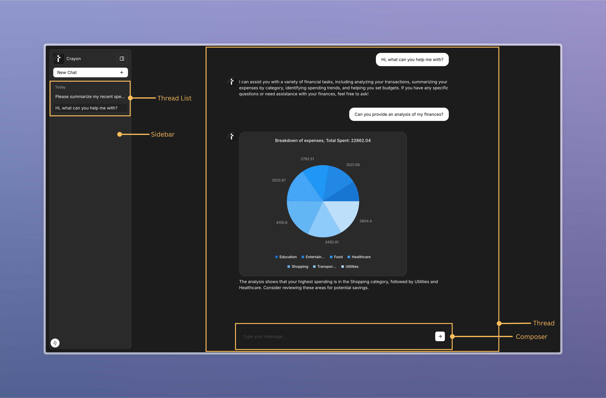

# Core Concepts

This document explains various concepts that Crayon is built around as well as how they relate to each other. It is
recommended to go through this document to get a complete picture of the system.

## Introduction

Crayon is an opinionated library that aims to provide everything you would need to build an AI agent. It provides 2
packages:

1. `react-core` contains the state management system for building an agent.
2. `react-ui` contains entire pre-built user interfaces as well as customizable UI components useful for building an agent.

Both packages are independent of each other. They do however, make it very quick and easy to build an agent when
used together.

The main principle of Crayon is to provide a flexible, backend-agnostic foundation for building AI agents. It handles common AI agent implementation challenges, allowing
developers to focus on their specific use cases rather than reinventing standard solutions.

## Shell

Crayon's UI package provides multiple "Shells", which are entire pre-built agent UIs. Each component used inside a shell is also exported separately to enable easy customization.
The following image shows one of the available shells - The "Standalone" Shell.

For a detailed guide on how to customize the UI, see <ins>[Customizing Crayon UI](../guides/customization/004-customizing-ui.mdx).</ins>

## Thread

A Thread is a single conversation session between a user and an AI agent. Each Thread:

- Maintains its own conversation history
- Preserves context throughout the interaction
- Allows the AI to reference and respond to previous messages

The Thread is controlled by a <ins>[`ThreadManager`](../reference/js/react-core/type-aliases/ThreadManager.md)</ins>, which handles the thread's state (e.g., message history) and provides actions to modify the Thread (e.g., adding messages, updating existing messages).

To create a ThreadManager, Crayon provides the <ins>[`useThreadManager`](../reference/js/react-core/functions/useThreadManager.md)</ins> React hook. This hook accepts configuration options and returns a fully functional ThreadManager instance.

## Thread List

The thread list represents multiple conversation threads between a user and an agent. It's commonly displayed in a sidebar that shows the user's conversation history and allows
switching between different threads.

The thread list is managed by a <ins>[`ThreadListManager`](../reference/js/react-core/type-aliases/ThreadListManager.md)</ins>, which handles the list's state and provides actions to modify the list (e.g., adding a new thread, deleting a thread).

To create a ThreadListManager, Crayon provides the <ins>[`useThreadListManager`](../reference/js/react-core/functions/useThreadListManager.md)</ins> React hook. This hook accepts configuration options and returns a fully functional ThreadListManager instance.

## Response Templates

If you are building an AI agent, chances are you might want to render the agent's responses in multiple formats beyond plain text, such as cards, charts or tables. This is
accomplished using response templates. They consist of two key components:

1. A schema that instructs the LLM how to structure its response data. (See <ins>[Structured Outputs](#structured-outputs)</ins>)
1. A React component that defines how the agent response should be rendered (e.g., cards, charts, tables)

This system allows you to:
- Define custom response formats for the agent response
- Ensure type-safe and predicable props for your React components

For a detailed implementation guide, see <ins>[Creating Response Templates](../guides/customization/005-response-templates.mdx).</ins>

## Structured Outputs

If you are using <ins>[Response Templates](#response-templates)</ins>, you would want the LLM to respond in a predictable, structured format that the UI can consistently understand and render.
This is accomplished by providing a schema to the LLM that instructs it on how to structure its response. This part is generally handled by the backend API that calls the LLM.

A detailed example of how structured outputs can be implemented in a backend API can be found at -
<ins>[Creating Response Templates: Backend API](../guides/customization/005-response-templates.mdx#step-3-creating-a-backend-endpoint-to-tell-the-llm-about-the-schema).</ins>

Here's a sequence diagram that shows how response templates and structured outputs work together:

```mermaid
sequenceDiagram
    participant User
    participant Frontend
    participant Backend
    participant LLM API

    User->>Frontend: Posts message
    Frontend->>Backend: Requests agent response
    Backend->>LLM API: Provides schema for all response templates and requests LLM response
    LLM API->>LLM API: Selects appropriate response template
    LLM API-->>Backend: Returns structured response with selected template
    Backend-->>Frontend: Replies with agent response and template name and component props
    Frontend-->>User: Renders the agent response using the given response template component
```
